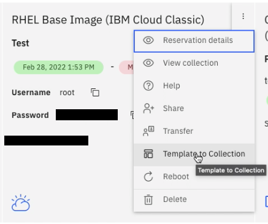
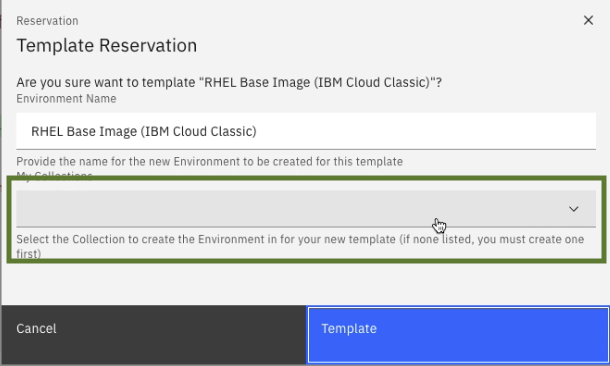
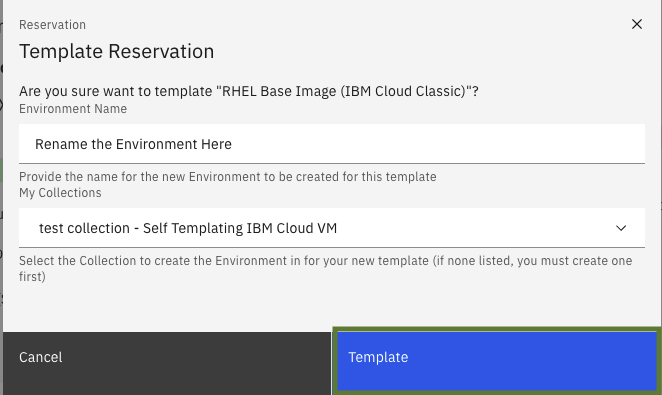
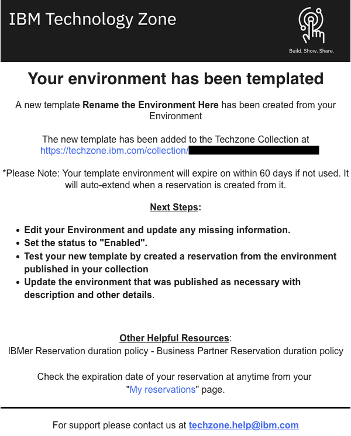
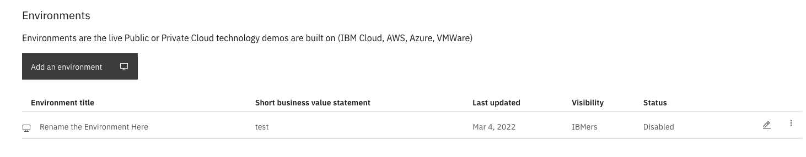
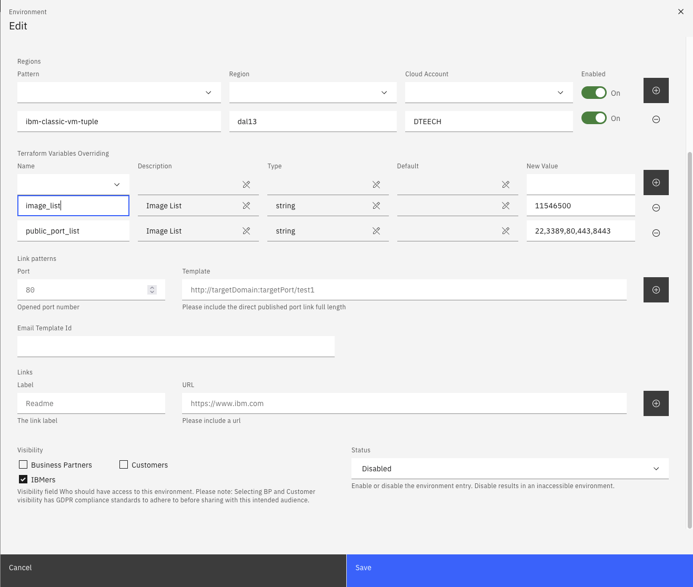
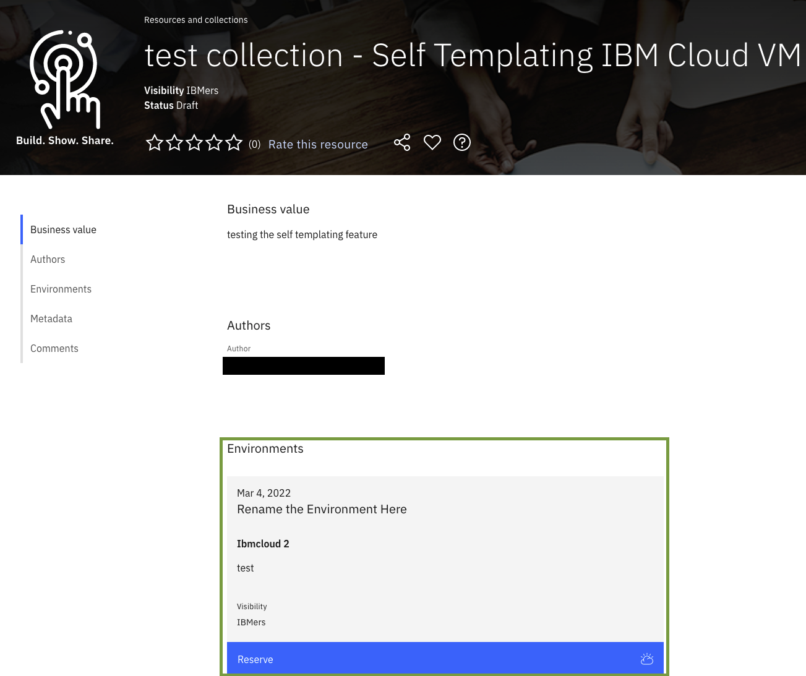

# Template an IBM Cloud VSI on Classic, VPC, and VMware Environments for Your Collection  

Steps to template an IBM Cloud Classic, VPC, and VMware Environments for your Collection. 

Note: templating is not available for OpenShift Clusters.

1.  Got to https://techzone.ibm.com/my/reservations  

2.  Select the 3 Dots Icon on your IBM Cloud reservation that will be templated  

3.  Select "Template to Collection"  
  

4.  Select the Collection this new Template will be used for  
  
  
5.  Select "Template" in the bottom right  
  

6.  When the Templating process is complete, you will receive an email  
  

7.  You can now edit your collection, and see the environmnet available, but disabled, select the pencil icon to edit it  
  

8.  Edit your Environment and update any missing information, set the status to "Active"
  

9. The environment will now be avialable to provision on your environment (A [Cache Update](https://github.com/IBM/itz-support-public/blob/main/IBM-Technology-Zone/IBM-Technology-Zone-Runbooks/cache-update.md) may be required to see the saved changes)  
  

### Support

For any questions, contact ITZ support - techzone.help@ibm.com
