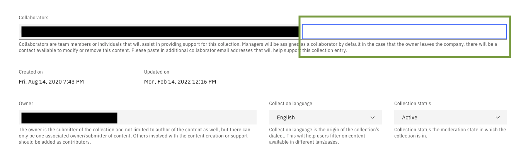

# Testing Collections/Environments Before Making Them Active

Add the tester or user as a collaborator to the collection and leave the status in draft.  
The user will be able to test as they need and once completed testing, the owner can remove them as a collaborator when they change status to live.  

See how to edit a collection [here](https://github.com/IBM/itz-support-public/blob/main/IBM-Technology-Zone/IBM-Technology-Zone-Runbooks/edit-a-collection.md)  

  

  

### Support

For any questions, contact ITZ support - techzone.help@ibm.com
