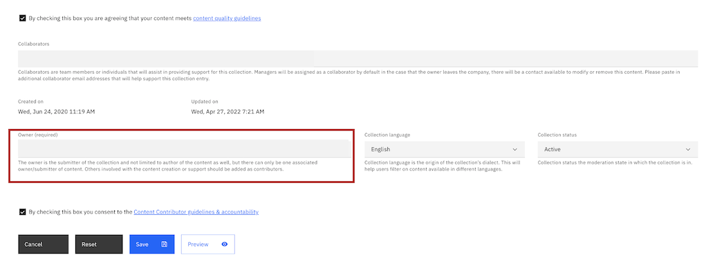

# Transfer Collection Ownership

Scenarios: 

- User has a new IBMid that they would like to transfer their collection ownership to the new IBMid.

- User no longer can support the collection and would like to associate a new owner to the collection.
 

Steps: 

1) Login to Technology Zone.

2) Navigate to My Library > My created resources and collections page.

3) Open the collection that you would like to change ownership of.

4) Select edit in the top right banner of the collection. 

5) Scroll down to the Owner (Required) field.

7) Remove the old IBMid and update the new IBMid email that the ownership is transferring to. 

8) After the update has been made, click Save at the bottom of the collection edit form. 

### Support

For any questions, contact ITZ support - techzone.help@ibm.com
