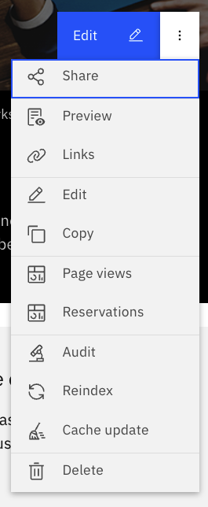
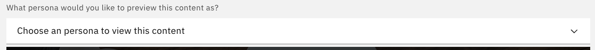
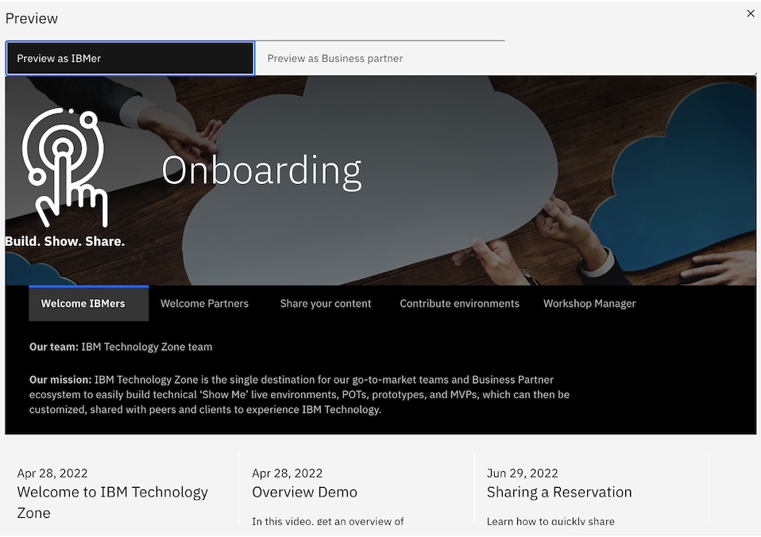
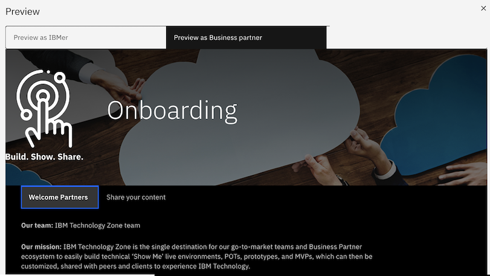

# How to View What Business Partners Would on a Collection

In this runbook we will walk through how to view what business partners would see on IBM Technology Zone collections!

**Note: This feature will only be accessible to IBMrs at this time. This feature was created to support IBM Technology Zone IBMr users that are working with Business Partners. This will allow IBMrs to now be able to have a view of what a Partner would see when they are shared a specific collection.

This feature will be accessible for all IBMrs on each collection. 

1. Start on your collection page.

2. Select the kabob menu on the right side, then click preview. 

3. Select what persona you would like to view the collection in. Persona options are IBMr or Partner.

## Examples

Notice in both persona example screenshots below that each persona (IBMr and Business Partner) will see different Journeys (tabs) and different resources and environments on each collection. Use this feature to see what exactly a Business Partner would see on each collection and easily navigate back from IBMer and Parnter to compare. 

- Example of IBMr persona view of Onboarding collection. Scroll down to see full list of resources and environments each persona will see on the collection.

- Example of Business Partner view of Onboarding collection. Scroll down to see full list of resources and environments each persona will see on the collection.

If you have questions as to why the content author made a specific collection, resource, environment, or journey (tab) only available to an IBMer. Feel free to contact the content owner to find out if the specific collection, resource, environment, or journey (tab) can be made available to business partners as well.
