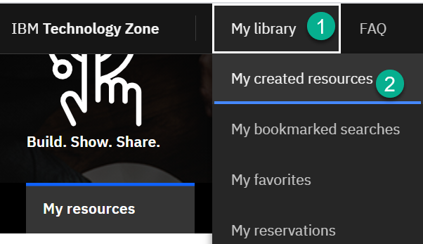
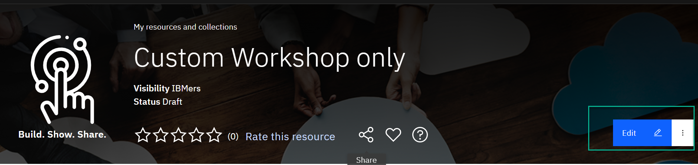
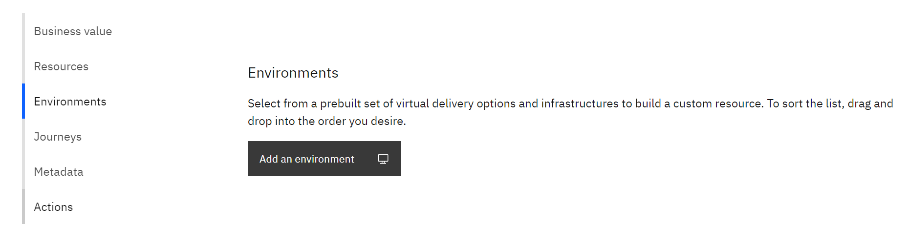
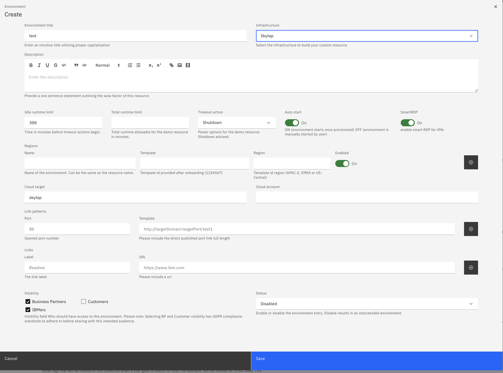
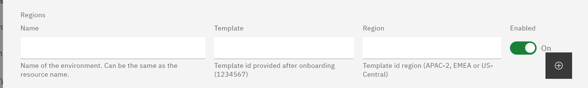
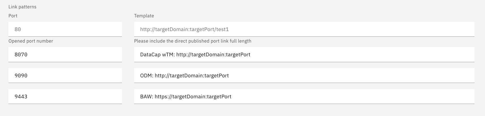
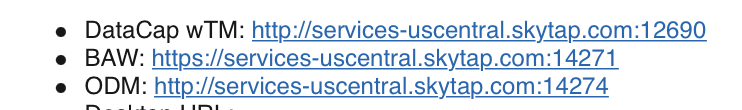
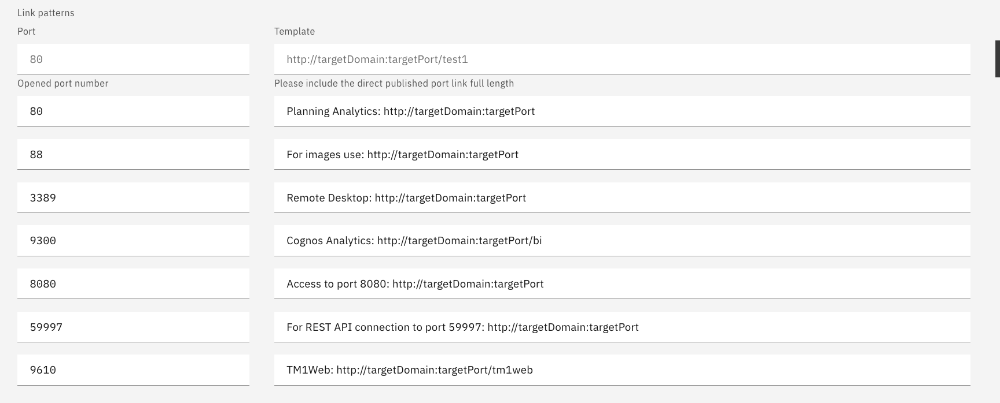
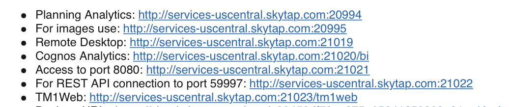

1. Log on to IBM Technology Zone https://techzone.ibm.com/

2.  "My Library" > "My created resource", if you haven't created one this will be required

 

3. Select the required resource/collection

4. click on "edit" 

5. Navigate to environment "add an environment"

a. choose "environment title" "Infrastructure" Skytap

6. Fill environment form 

 Scroll down to Region, use the plus sign (+) to add template ids provided to you by the support team Enter each regions separately 
 
 

If you have Opened Ports for the templates define them using Link Patterns sections. Use the plus sign (+) to add all ports opened

Port - enter the port number opened
Template - syntax for published  http://targetDomain:targetPort --- targetDomain (auto created) targetPorts(auto created)

Example Link Patterns

Port and template

Automated Mail output

Port and template

Automated Mail output

7. Click Save once form is completed

### Support

For any questions, contact ITZ support - techzone.help@ibm.com
